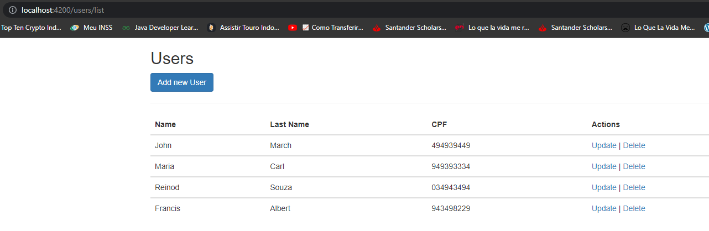
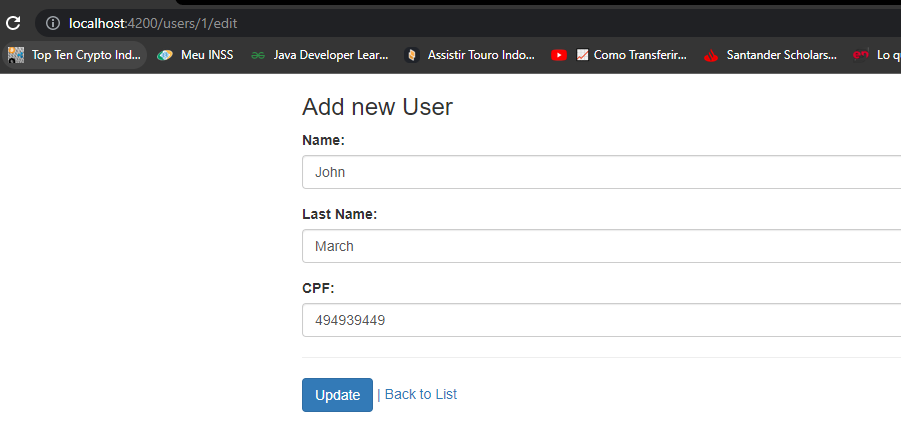
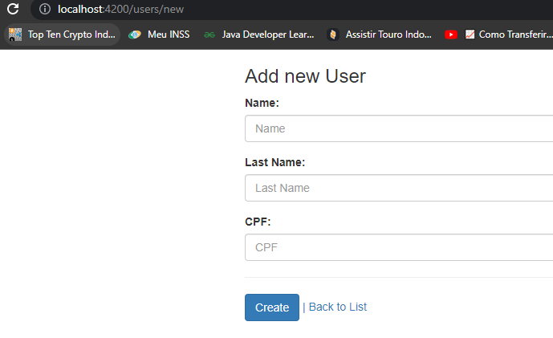
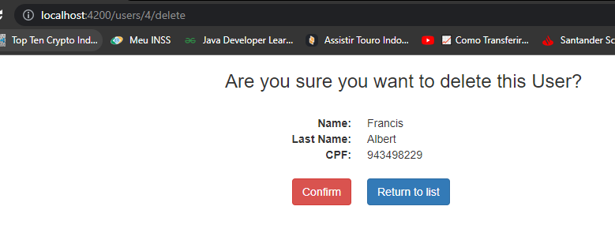
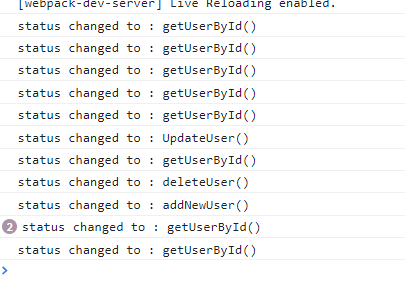
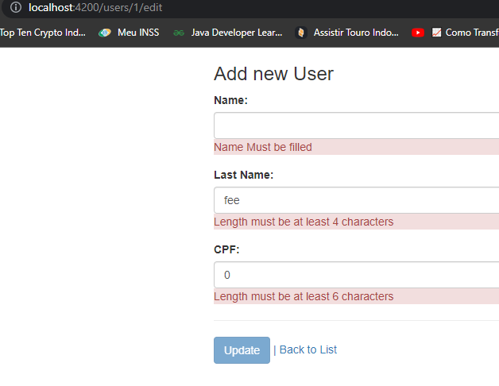

# Angular 2 - Crud register of User.

=

## 🖼 Screenshot application screen  

Home

 
 

List Users

 
 

Update User

 
 

Register User

 
 

Delete

 
 

Logging

 
 

Validator

 
 

 
## 🚀 Tech Used 
 

- Angular 
- Typescript  
- html e css  
- Bootstrap
 

## Linkedin below

<h4 align="center">
   Created by   <a href="https://www.linkedin.com/in/luiz-carlos-b50693173/" target="_blank"> Luiz Carlos </a>
</h4>

</html>
